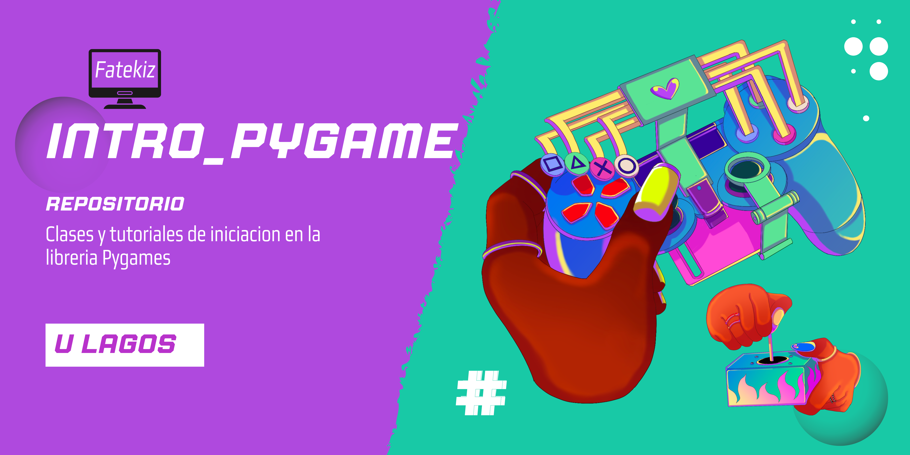

# intro_Pygame

   
   

 

 

## ¿Qué es?

Repositorio creado con el fin de llevar un seguimiento en nuestro proyecto de videojuego
realizado por los estudiantes afiliados a este repositorio.

### ¿cómo lo hacemos?

Este videojuego está siendo desarrollado con el lenguaje "Python"
ocupando la libreria pygmame.
